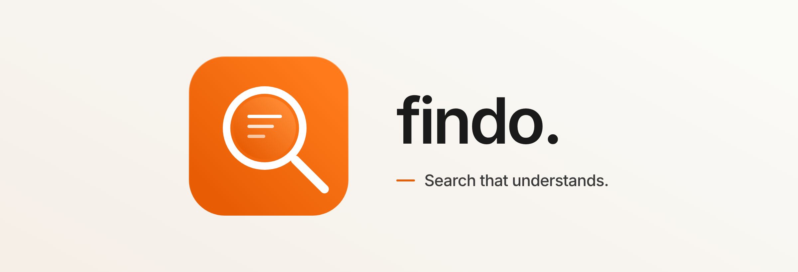

<div align="center">
  

  <p>
    <strong>Local-first semantic search for your files.</strong><br>
    Find anything on your disk by meaning, not filename. 100% private.
  </p>

  <p>
    <a href="#install">Install</a> •
    <a href="#features">Features</a> •
    <a href="#supported-formats">Formats</a> •
    <a href="#configuration">Configuration</a> •
    <a href="#architecture">Architecture</a>
  </p>

  <p>
    
    
    
    
    
  </p>
</div>

---

Findo indexes files on your disk with Gemini Embedding 2 and opens a Raycast-style search window on a global hotkey. Search by meaning — *"people on stage"* finds your conference videos; *"revenue chart"* finds that buried PowerPoint slide. Files never leave your machine; only embedding requests go out.

## Features

- **Semantic search** across text, code, images, video, audio, and documents — one query covers everything.
- **Natural language filters** — *"pdfs from last week"*, *"screenshots larger than 2 mb"* get parsed into structured constraints automatically.
- **Raycast-style UI** with thumbnail previews and a smart context-aware preview panel.
- **Local-first**: the only network calls are embedding requests to Gemini.
- **Real-time watching** with crash-safe indexing, atomic HNSW saves, and startup reconciliation.
- **Video search** at timestamp-level precision (30s chunked embedding, 5s overlap).
- **Configurable ignores** — 20 sensible defaults (`node_modules`, `.git`, `venv`, …) seeded on first launch; add your own folder patterns.
- **Global hotkey** — summon the search window from anywhere.

## Supported formats

<details open>
<summary><strong>No external tools needed</strong></summary>

**Images** — `.jpg` `.jpeg` `.png` `.webp` `.heic` `.heif`

**Documents**

| Extension | Format | Method |
|---|---|---|
| `.pdf` | PDF | Gemini visual embedding + text extraction |
| `.docx` | Word | XML text extraction |
| `.pptx` | PowerPoint | XML text extraction |
| `.xlsx` | Excel | Full cell/sheet extraction via excelize |

**Text / Code** — auto-detected via content sniffing, no hardcoded extension list. Any file with valid UTF-8 and no null bytes is treated as text. Common examples: `.go` `.py` `.js` `.ts` `.tsx` `.rs` `.c` `.cpp` `.java` `.rb` `.php` `.swift` `.kt` `.md` `.json` `.yaml` `.toml` `.sql` `.sh` `.html` `.css` `.xml` `.csv` `.log` …

</details>

<details>
<summary><strong>Requires ffmpeg</strong></summary>

**Video** — preprocessed to 480p/5fps, chunked into 30s segments with 5s overlap: `.mp4` `.mov` `.avi` `.webm` `.mpeg` `.mpg` `.flv` `.wmv` `.3gp`

**Audio** — `.mp3` `.wav` `.flac` `.aac` `.ogg` `.aiff`

</details>

<details>
<summary><strong>Requires LibreOffice (optional — legacy formats only)</strong></summary>

Modern Office formats work without it. LibreOffice converts legacy documents to PDF before embedding.

`.doc` `.ppt` `.xls` `.odt` `.odp` `.ods` `.rtf`

</details>

## Install

### Prerequisites

- [Go](https://go.dev/) 1.26+
- [Wails CLI](https://wails.io/) v2 — `go install github.com/wailsapp/wails/v2/cmd/wails@latest`
- [Node.js](https://nodejs.org/) 18+
- A Gemini API key exported as `GEMINI_API_KEY`
- [ffmpeg](https://ffmpeg.org/) — required for video/audio indexing
- [LibreOffice](https://www.libreoffice.org/) — optional, for legacy Office formats

### Build from source

```bash
# Development mode (hot reload)
# -tags webkit2_41 required on Linux with webkit2gtk-4.1 (Ubuntu 22.04+)
wails dev -tags webkit2_41

# Production binary
wails build -tags webkit2_41
```

## Quickstart

1. Launch Findo. Add a folder to index from the settings panel.
2. Wait for the initial indexing pass to complete — progress is shown in the status bar.
3. Press the global hotkey (configurable in settings) to open the search window anywhere.
4. Type a query. Use plain language — *"tax documents from march"*, *"golang test files"*, *"my resume"*.

## Configuration

Runtime tunables (indexing concurrency, embedder batch size, rate limits, HNSW parameters, search thresholds, NL-query timeouts) live in `config.toml`:

- Linux / macOS: `~/.config/findo/config.toml`
- Windows: `%APPDATA%\findo\config.toml`

Missing file or missing keys fall back to the defaults in [`internal/config/defaults.toml`](internal/config/defaults.toml).

## Architecture

Three layers:

1. **React frontend** — floating search window, filter chips derived from natural-language input, indexing progress bar, context-aware preview panel.
2. **Go backend** — file watcher, indexing pipeline (classify → extract/chunk → embed → store), search engine (embed query → HNSW cosine → join metadata → rerank → relax), system tray.
3. **Storage** — SQLite as the source of truth for file metadata; TFMV/hnsw for 768-dim vector search. Each chunk's embedding is also stored inline in SQLite for brute-force fallback on small indexes.

The indexing pipeline runs concurrent workers pulling jobs from a shared channel, batches up to 100 chunks per Gemini API call, uses two-phase commit to avoid phantom entries after a crash, and honors `Retry-After` on 429s via a shared pause mechanism. NL query understanding combines a local grammar parser (`kind:`, `ext:`, `size:`, `before:`, `after:`, …) with Gemini 2.5 Flash-Lite for anything ambiguous, cached in SQLite.

### Tech stack

- **Desktop:** Wails v2
- **Frontend:** React + TypeScript
- **Backend:** Go (pure Go, no CGO)
- **Vector DB:** [TFMV/hnsw](https://github.com/TFMV/hnsw)
- **Metadata DB:** SQLite via [ncruces/go-sqlite3](https://github.com/ncruces/go-sqlite3)
- **Embeddings:** Gemini Embedding 2 Preview (768-dim via MRL)
- **Video:** ffmpeg (subprocess)
- **File watching:** fsnotify

## Development

```bash
make test-unit          # default build, under 30s
make test-integration   # -tags integration
make test-e2e           # -tags e2e
make test-all           # all three, sequentially

cd frontend && npm run lint
```

## Contributing

Issues and PRs welcome. Keep commits in a natural developer tone — no AI attribution, no emojis in commit messages.

## License

See [LICENSE](LICENSE).
